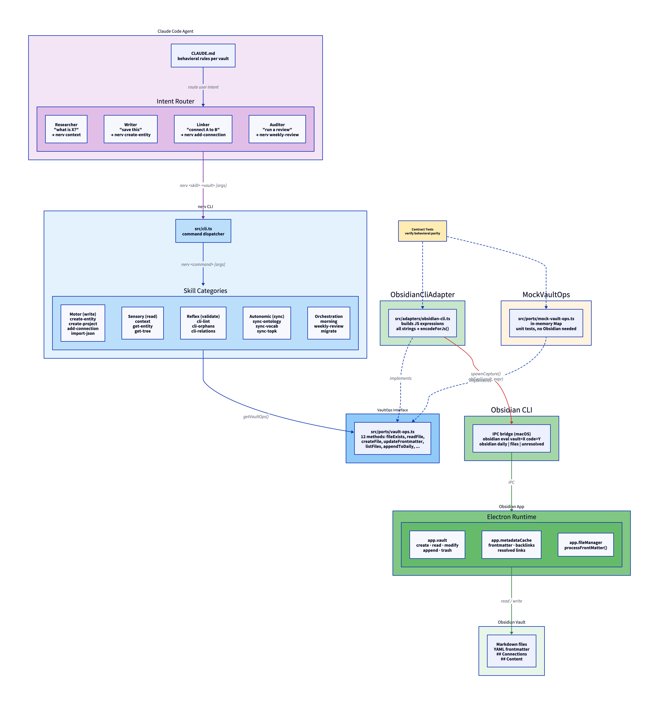
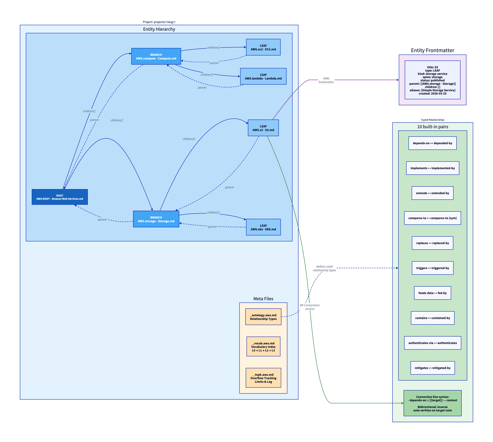
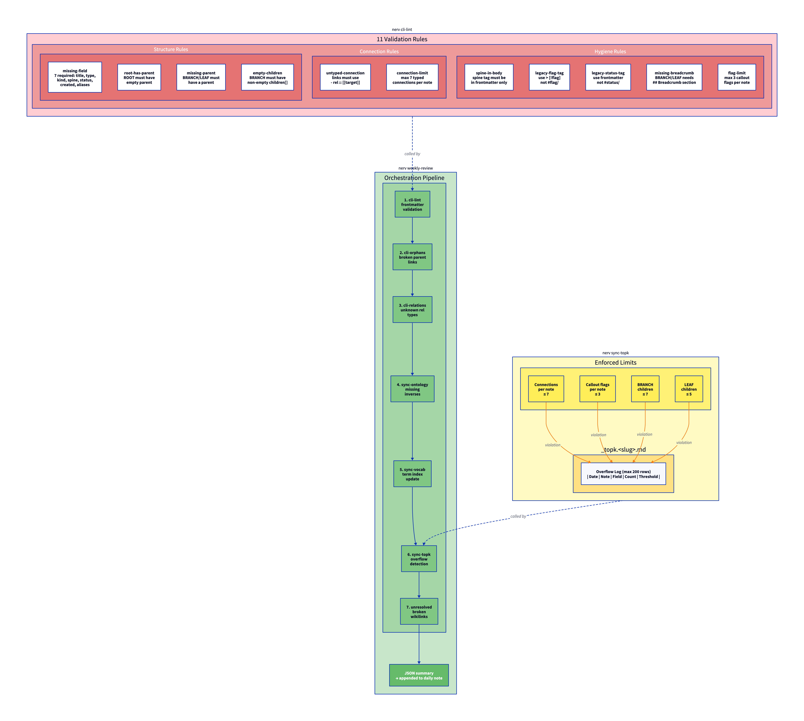

# NERV CLI

A structured knowledge CLI for multi-vault Obsidian, built around a typed ontology of entities and relationships.

nerv manages knowledge vaults where every note is a typed entity (ROOT, BRANCH, or LEAF) with enforced metadata, bidirectional relationships, and automated health audits. It connects to a running Obsidian instance via the native CLI, giving agents and developers programmatic access to create, query, validate, and sync structured knowledge without opening the app UI.

Built for knowledge engineers and developers deploying Claude Code agents against local Obsidian vaults on macOS.

---

## Getting started

### Prerequisites

- macOS
- [Bun](https://bun.sh) runtime
- [Obsidian](https://obsidian.md) >= 1.12.4 with CLI registered (Settings > General > Command line interface)

### Install Bun

```bash
curl -fsSL https://bun.sh/install | bash
```

Add Bun to your shell and reload:

```bash
echo 'export BUN_INSTALL="$HOME/.bun"' >> ~/.zshrc && echo 'export PATH="$BUN_INSTALL/bin:$PATH"' >> ~/.zshrc && source ~/.zshrc
```

Verify the installation:

```bash
bun --version
bunx --version
```

### Install

```bash
git clone <repo-url> && cd obsidian-nerv
bun install
bun run build          # produces bin/nerv (~61 MB self-contained binary)
```

To run any package binary without installing it globally, use `bunx`:

```bash
bunx lint-staged       # run lint-staged
bunx tsc --noEmit      # run the TypeScript compiler
```

Add `bin/` to your PATH or symlink `bin/nerv` to a directory already in your PATH.

### First vault

```bash
nerv add-vault --vault study --path ~/vaults/study
nerv current-vault                          # confirm active vault
nerv create-project study aws "Amazon Web Services"
nerv create-entity study aws LEAF s3 "S3 Overview" ROOT concept
```

### Vault resolution

nerv resolves which vault to operate on using this priority chain:

1. `--vault <name>` flag (explicit per-command override)
2. `NERV_DEFAULT_VAULT` environment variable
3. Default vault in `.nerv/vaults.json` registry

---

## Usage

### Commands

| Category      | Commands                                                                  | Purpose                 |
| ------------- | ------------------------------------------------------------------------- | ----------------------- |
| Motor         | `create-project`, `create-entity`, `add-connection`, `import-json`        | Write structured notes  |
| Sensory       | `context`, `get-entity`, `get-tree`, `get-knowledge-gap`, `explain-topic` | Read and query          |
| Reflex        | `cli-lint`, `cli-orphans`, `cli-relations`                                | Validate vault health   |
| Autonomic     | `sync-ontology`, `sync-vocab`, `sync-topk`                                | Keep meta files in sync |
| Orchestration | `morning`, `weekly-review`, `migrate`                                     | Composite workflows     |
| Dev           | `dev/adr`, `dev/dependency-map`, `dev/code-link`, `dev/dev-cycle`         | Software development    |
| Study         | `study/quiz`, `study/coverage`, `study/progress`                          | Learning workflows      |
| Canvas        | `canvas/tree`, `canvas/relations`, `canvas/dependencies`                  | JSON Canvas 1.0 output  |
| Web Ingest    | `web-ingest/add`, `web-ingest/batch`, `web-ingest/monitor`                | Import web content      |

### Vault management

```bash
nerv list-vaults
nerv switch-vault --vault dev
nerv add-vault --vault dev --path ~/vaults/dev
nerv remove-vault --vault old --force
```

Run `nerv --help` for the full command list.

---

## Ontology

The ontology is a typed knowledge schema for Obsidian notes. Every note in a vault is an entity with structured YAML frontmatter, organized in a project hierarchy and connected by typed relationships.

### Entity types

| Type   | Role                       | Parent   | Children |
| ------ | -------------------------- | -------- | -------- |
| ROOT   | Top-level project anchor   | None     | Yes      |
| BRANCH | Sub-domain grouping node   | Required | Yes      |
| LEAF   | Atomic concept or decision | Required | None     |

### Frontmatter fields

Every entity note requires these fields (enforced by `cli-lint`):

| Field    | Type                                          | Purpose                  |
| -------- | --------------------------------------------- | ------------------------ |
| title    | string                                        | Display name             |
| type     | `ROOT` / `BRANCH` / `LEAF`                    | Entity classification    |
| kind     | string                                        | Domain subtype           |
| spine    | string                                        | Topical sort key         |
| status   | `draft` / `review` / `published` / `archived` | Lifecycle stage          |
| parent   | wikilink (empty for ROOT)                     | Upward hierarchy link    |
| children | wikilink[]                                    | Downward hierarchy links |

### Relationships

Connections between entities are typed and bidirectional. Each relationship type (e.g. `depends-on`) has a registered inverse (e.g. `depended-by`). When you run `nerv add-connection`, both forward and inverse links are written automatically.

Connections are stored in each note's `## Connections` section:

```markdown
- depends-on :: [[AWS.iam-basics - IAM Basics]] — requires IAM permissions
```

### Project meta files

Each project auto-generates three supporting files:

| File                  | Purpose                                               |
| --------------------- | ----------------------------------------------------- |
| `_ontology.<slug>.md` | Relationship type registry (10 default types)         |
| `_vocab.<slug>.md`    | Domain vocabulary index (L0-L3 term hierarchy)        |
| `_topk.<slug>.md`     | Overflow tracking (connection and child count limits) |

---

## Project structure

```text
src/
├── cli.ts                    # Entry point — routes argv to commands
├── index.ts                  # Library re-exports
├── types/                    # Shared type definitions
│   ├── entity.ts             #   EntityType (LEAF/BRANCH/ROOT), NoteEntity
│   ├── project.ts            #   ProjectConfig, VaultRef
│   ├── connection.ts         #   Connection, ConnectionLine
│   └── result.ts             #   CommandResult<T>, ExitCode
├── lib/                      # Core utilities
│   ├── obsidian.ts           #   resolveVault, obEval, dailyAppend, rollbackLog
│   ├── shell.ts              #   spawnCapture (30s timeout)
│   ├── json.ts               #   encodeForJs, parseJson
│   ├── logger.ts             #   logError, logWarn
│   ├── vault-registry.ts     #   .nerv/vaults.json management
│   ├── canvas.ts             #   JSON Canvas 1.0 types
│   └── defuddle.ts           #   Web content extraction
├── ports/                    # Interface definitions (adapter pattern)
│   ├── vault-ops.ts          #   VaultOps interface (12 methods)
│   ├── dev-ops.ts            #   DevOps interface (4 methods)
│   ├── provider.ts           #   DI: getVaultOps / setVaultOps
│   └── mock-vault-ops.ts     #   In-memory test double
├── adapters/                 # Backend implementations
│   ├── obsidian-cli.ts       #   Production adapter (obEval)
│   └── obsidian-dev.ts       #   Plugin dev adapter
├── commands/                 # Command modules
│   ├── create-project.ts     #   Motor: scaffold a new project
│   ├── create-entity.ts      #   Motor: create ROOT/BRANCH/LEAF
│   ├── add-connection.ts     #   Motor: bidirectional relationships
│   ├── import-json.ts        #   Motor: bulk import
│   ├── context.ts            #   Sensory: relevance-scored search
│   ├── get-entity.ts         #   Sensory: entity resolution
│   ├── get-tree.ts           #   Sensory: hierarchy view
│   ├── cli-lint.ts           #   Reflex: 11 validation rules
│   ├── cli-orphans.ts        #   Reflex: broken parent links
│   ├── cli-relations.ts      #   Reflex: relationship audit
│   ├── sync-ontology.ts      #   Autonomic: relationship registry
│   ├── sync-vocab.ts         #   Autonomic: vocabulary index
│   ├── sync-topk.ts          #   Autonomic: overflow tracking
│   ├── weekly-review.ts      #   Orchestration: weekly audit
│   ├── morning.ts            #   Orchestration: daily briefing
│   ├── migrate.ts            #   Orchestration: vault migrations
│   ├── dev/                  #   Dev skills (adr, code-link, ...)
│   ├── study/                #   Study skills (quiz, coverage, ...)
│   ├── canvas/               #   Canvas output (tree, relations, ...)
│   └── web-ingest/           #   Web import (add, batch, monitor)
├── templates/                # Typed note renderers
│   ├── leaf.ts               #   renderLeaf(LeafParams)
│   ├── branch.ts             #   renderBranch(BranchParams)
│   ├── root.ts               #   renderRoot(RootParams)
│   ├── ontology.ts           #   renderOntology(OntologyParams)
│   └── ...                   #   vocab, topk, base, daily, inbox
└── configuration/            # Obsidian .obsidian/ config templates
```

---

## Architecture

### System overview

How an AI agent's intent flows through nerv into an Obsidian vault:



A Claude Code agent (configured via `CLAUDE.md` per vault) detects user intent and routes to one of four patterns: **Researcher** (read), **Writer** (create), **Linker** (connect), or **Auditor** (review). Each pattern invokes nerv CLI skills grouped by category — Motor, Sensory, Reflex, Autonomic, or Orchestration.

Commands never call Obsidian directly. They call `getVaultOps()` which returns a `VaultOps` interface (12 methods for all vault I/O). In production, `ObsidianCliAdapter` implements this interface by building JS expressions and sending them via `obEval(vault, expr)` → `obsidian eval vault=X code=Y` (IPC) → Obsidian's Electron runtime where `app.vault`, `app.metadataCache`, and `app.fileManager` execute the operation. For tests, `MockVaultOps` provides an in-memory Map-backed double; contract tests verify both adapters behave identically.

All user-supplied strings pass through `encodeForJs()` before embedding in `obEval()` expressions to prevent JavaScript injection. See [`docs/architecture/adapter-pattern.md`](docs/architecture/adapter-pattern.md) for the full VaultOps reference and guide to adding new operations.

### Ontology model

How knowledge is structured inside a vault:



Each project lives under `projects/<slug>/` and contains a tree of typed entities. **ROOT** is the project anchor (no parent), **BRANCH** nodes group sub-domains (parent required, children required), and **LEAF** nodes are atomic concepts (parent required, no children). Every entity has YAML frontmatter with required fields: `title`, `type`, `kind`, `spine`, `status`, `parent`, `children`. Parent-child links are bidirectional — the child's `parent` field points up, the parent's `children[]` array points down.

Entities connect to each other through typed relationships stored in `## Connections` sections using the syntax `- rel-type :: [[target]] — context`. Each project's `_ontology.<slug>.md` defines 10 default relationship types with registered inverses (e.g. `depends-on` ↔ `depended-by`). When `nerv add-connection` writes a forward link, it automatically writes the inverse on the target note.

Two additional meta files support each project: `_vocab.<slug>.md` (domain vocabulary organized in L0-L3 tiers) and `_topk.<slug>.md` (overflow tracking with enforced limits).

### Validation and top-K enforcement

How vault health is maintained:



`nerv cli-lint` applies 11 rules covering structure (required fields, parent/child integrity), connections (typed syntax, max 7 per note), and hygiene (no legacy tags, breadcrumb sections present). `nerv sync-topk` enforces capacity limits — connections per note (≤7), callout flags (≤3), BRANCH children (≤7), LEAF children (≤5) — and logs violations to the project's `_topk.<slug>.md` overflow log (capped at 200 rows).

`nerv weekly-review` orchestrates the full health pipeline: lint → orphan detection → unknown relations → missing inverses → vocabulary sync → overflow tracking → unresolved wikilinks. Results are output as JSON and appended to the daily note.

> D2 diagram sources live in [`docs/architecture/`](docs/architecture/). Regenerate with: `d2 docs/architecture/<name>.d2 docs/architecture/<name>.png`

---

## Testing

```bash
# Unit tests — uses MockVaultOps, no Obsidian required
bun run test:unit

# Integration tests — requires a running Obsidian instance
bun run test:integration

# All tests
bun test
```

### Integration test environment

Integration tests need a `.env.integration` file. Copy the example and edit as needed:

```bash
cp .env.integration.example .env.integration
```

| Variable            | Default                      | Purpose                                        |
| ------------------- | ---------------------------- | ---------------------------------------------- |
| `NERV_TEST_VAULT`   | `e2e-integration-test-vault` | Vault name created for the test run            |
| `NERV_VAULT_PATH`   | `./docs/vaults`              | Directory where the test vault is created      |
| `NERV_SKIP_CLEANUP` | _(unset)_                    | Set to `1` to keep the vault and Obsidian open |

**Clean mode (default):** after the suite finishes, the test vault is deleted from disk, unregistered from nerv, and Obsidian is quit.

**Keep mode (`NERV_SKIP_CLEANUP=1`):** vault and Obsidian are left in place — useful for inspecting test state after a failure.

### Contract tests

Contract tests verify that `MockVaultOps` and `ObsidianCliAdapter` satisfy the same behavioral contract. This ensures unit tests (which use the mock) faithfully represent production behavior. See `tests/unit/ports/vault-ops-contract.ts`.

### Validation pipeline

The pre-commit hook runs lint-staged automatically. To run the full pipeline manually:

```bash
bun run validate       # lint:fix + prettier:fix + typecheck
```

---

## Contributing

### Code style

ESLint + Prettier enforced via lint-staged (husky pre-commit hook). Run `bun run format` to auto-fix.

### Adding a new command

1. Create `src/commands/<name>.ts` exporting a `Command` with `name`, `description`, and `run(args)`.
2. Register it in the `COMMANDS` array in `src/cli.ts`.
3. Use `getVaultOps()` for all vault I/O — never import `obEval` directly.
4. Write unit tests using `MockVaultOps` (see [`docs/architecture/adapter-pattern.md`](docs/architecture/adapter-pattern.md) for the pattern).
5. If you need a new vault operation, follow the 5-step process in [`docs/architecture/adapter-pattern.md`](docs/architecture/adapter-pattern.md).

### Security

Every string argument embedded in an `obEval()` expression **must** pass through `encodeForJs()`. Never use string concatenation or template literals to interpolate user-supplied values directly.

---

## Further reading

- [`docs/architecture/adapter-pattern.md`](docs/architecture/adapter-pattern.md) — VaultOps interface reference, contract tests, adding operations
- [`docs/cli-guide/`](docs/cli-guide/) — Detailed command documentation by skill category
- [`docs/obsidian-docs/`](docs/obsidian-docs/) — Obsidian platform reference (properties, bases, CLI)
- [`docs/obsidian-skills/`](docs/obsidian-skills/) — Agent skill definitions
