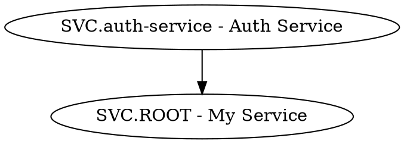

# Dev skills

Skills specific to development vaults (`dev-projectA`).
For: developers building plugins, recording architecture decisions, and mapping system dependencies.

[← Back to CLI Guide](cli-guide-index.md)

---

## `dev-cycle.sh`

Convenience wrapper for the plugin development feedback cycle: reload → check errors → stream console → optionally capture a screenshot.

```bash
dev-cycle.sh <vault> <plugin-id> [--screenshot]
```

**Parameters**

| Parameter      | Description                                                          |
| -------------- | -------------------------------------------------------------------- |
| `vault`        | Dev vault name (e.g. `dev-projectA`)                                 |
| `plugin-id`    | Directory name under `.obsidian/plugins/` — **not** the display name |
| `--screenshot` | Capture a viewport screenshot after a successful cycle               |

**4-step feedback cycle**

```text
Edit source → plugin:reload → dev:errors → dev:console → iterate
                                   ↓ errors?
                              display + stop
```

| Step | Command                                          | Purpose                              |
| ---- | ------------------------------------------------ | ------------------------------------ |
| 1    | _(edit source files)_                            | Make code changes                    |
| 2    | `obsidian plugin:reload vault=<v> plugin=<id>`   | Hot-reload without restarting        |
| 3a   | `obsidian dev:errors vault=<v>`                  | Check for JS errors; stop if present |
| 3b   | `obsidian dev:console vault=<v>`                 | Review warnings and log output       |
| 4    | `obsidian dev:screenshot vault=<v>` _(optional)_ | Capture visual evidence              |

**Example**

```bash
dev-cycle.sh dev-projectA my-custom-plugin
# → Reloaded my-custom-plugin
# → No errors
# → [MyPlugin] Loaded successfully
# → Cycle complete

dev-cycle.sh dev-projectA my-custom-plugin --screenshot
# → ... (same as above)
# → Screenshot: /tmp/obsidian-screenshot-1234567890.png
```

> [!important]
> Pass the plugin **directory name** (e.g. `my-custom-plugin`), not the display name from Settings.
> Passing the display name causes a silent no-op (exit 0, no reload).

> [!caution]
> `dev:console` output may contain sensitive data (API keys, tokens) logged by other plugins.
> Do not commit its output to version control or share in public channels.

---

## `adr.sh`

Create an Architecture Decision Record as a LEAF note with `kind: decision`, `decision-date`, `decision-status: proposed`, and structured Content sections.

```bash
adr.sh <vault> <project_slug> "<title>" [<parent_slug>]
adr.sh vault=<name> <project_slug> "<title>" [<parent_slug>]
```

**Auto-generated slug** — `adr-YYYYMMDD-<slugified-title>`

**Frontmatter additions** (on top of standard LEAF fields)

```yaml
kind: decision
decision-date: 2026-03-25
decision-status: proposed
```

**Content structure**

```markdown
## Content

### Context

_What problem or force is driving this decision?_

### Decision

_What was decided? State it as a full sentence._

### Consequences

_What are the resulting trade-offs, risks, and obligations?_
```

**Example**

```bash
adr.sh dev-projectA svc "Use PostgreSQL for session storage"
# ADR created: projects/svc/SVC.adr-20260325-use-postgresql... .md
#   decision-date:   2026-03-25
#   decision-status: proposed
```

**Idempotency** — delegates to `create-entity.sh`; exits 0 if the note already exists.

---

## `dependency-map.sh`

Filter the full relationship graph to `depends-on` edges only.

```bash
dependency-map.sh <vault> <project_slug> [--format json|dot]
dependency-map.sh vault=<name> <project_slug> [--format json|dot]
```

**JSON output**

```json
{
  "project": "svc",
  "edges": [
    {
      "source": "SVC.auth-service - Auth Service",
      "target": "SVC.ROOT - My Service",
      "context": ""
    }
  ]
}
```

**DOT output** (`--format dot`)



**Example**

```bash
dependency-map.sh dev-projectA svc
dependency-map.sh dev-projectA svc --format dot | dot -Tsvg > deps.svg
```

---

## `code-link.sh`

Append a code-path reference to a note's `## Connections` section.

```bash
code-link.sh <vault> "<note-path>" "<code-path>"
code-link.sh vault=<name> "<note-path>" "<code-path>"
```

**Appends**

```markdown
- implements :: `src/auth/handler.ts`
```

**Example**

```bash
code-link.sh dev-projectA \
  "projects/svc/SVC.auth-service - Auth Service.md" \
  "src/auth/handler.ts"
# code-link: appended to projects/svc/SVC.auth-service - Auth Service.md
#   - implements :: `src/auth/handler.ts`
```

**Security** — rejects code paths containing `]]` or newlines.

**Idempotency** — checks for exact code-path string before appending; re-running exits 0 with "already present".
