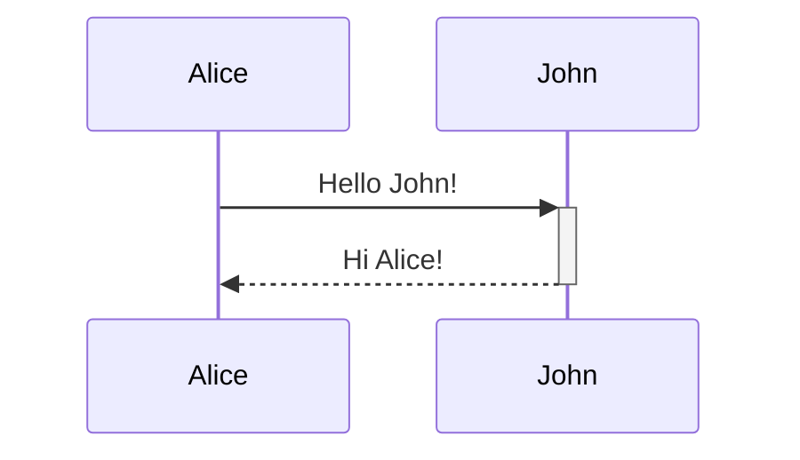

# Editing and Formatting

Obsidian uses **Obsidian Flavored Markdown (OFM)** — a superset combining CommonMark, GitHub Flavored Markdown, LaTeX, and Obsidian-specific extensions.

---

## Text formatting

| Style             | Syntax                   |
| ----------------- | ------------------------ |
| **Bold**          | `**text**` or `__text__` |
| _Italic_          | `*text*` or `_text_`     |
| ~~Strikethrough~~ | `~~text~~`               |
| ==Highlight==     | `==text==`               |
| `Inline code`     | `` `code` ``             |
| Bold + italic     | `***text***`             |

To display a formatting character literally, prefix it with `\`.

---

## Headings

```markdown
# Heading 1

## Heading 2

### Heading 3

#### Heading 4

##### Heading 5

###### Heading 6
```

Headings become anchor points — link directly to them with `[[Note#Heading]]`.

---

## Lists

**Unordered** — use `-`:

```markdown
- Item one
- Item two
  - Nested item
```

**Ordered** — use `1.` for every item:

```markdown
1. First
1. Second
   1. Nested
```

**Task lists**:

```markdown
- [x] Completed task
- [ ] Incomplete task
```

Click a checkbox in Reading or Live Preview mode to toggle it. Press `Tab` / `Shift+Tab` to adjust nesting.

---

## Code

**Inline code** — wrap with single backticks: `` `print()` ``

**Fenced code blocks** — specify a language for syntax highlighting:

````markdown
```python
def hello():
    print("Hello, world!")
```
````

Obsidian uses **Prism** for syntax highlighting in Reading view.

**Nesting code blocks** — use four or more backticks for the outer block:

`````markdown
````markdown
```js
console.log('hello');
```
````
`````

---

## Tables

```markdown
| First name | Last name |
| ---------- | --------- |
| Max        | Planck    |
| Marie      | Curie     |
```

**Column alignment** — add `:` to the separator row:

```markdown
| Left-aligned | Center-aligned | Right-aligned |
| :----------- | :------------: | ------------: |
| Content      |    Content     |       Content |
```

**Pipes inside cells** — escape with `\`:

```markdown
| Column 1        |
| --------------- |
| [[Page\|Alias]] |
```

In Live Preview, right-click any table to add/delete rows and columns.

---

## Callouts

```markdown
> [!info]
> This is a callout block. Supports **Markdown** and [[Wikilinks]].
```

**Custom title**:

```markdown
> [!tip] Custom title text
> Body content here.
```

**Foldable** — add `+` (starts open) or `-` (starts collapsed) after the type:

```markdown
> [!faq]- Collapsed by default
> Hidden until clicked.
```

**Supported callout types**

| Type identifier(s)                | Purpose                   |
| --------------------------------- | ------------------------- |
| `note`                            | General notes             |
| `abstract`, `summary`, `tldr`     | Summaries                 |
| `info`                            | Informational content     |
| `todo`                            | Action items              |
| `tip`, `hint`, `important`        | Tips and important points |
| `success`, `check`, `done`        | Success states            |
| `question`, `help`, `faq`         | Questions and FAQs        |
| `warning`, `caution`, `attention` | Warnings                  |
| `failure`, `fail`, `missing`      | Failure states            |
| `danger`, `error`                 | Errors                    |
| `bug`                             | Bug reports               |
| `example`                         | Examples                  |
| `quote`, `cite`                   | Quotations                |

Type identifiers are case-insensitive. Any unknown type renders as `note`.

**Nested callouts** — add extra `>` prefixes:

```markdown
> [!warning] Outer
>
> > [!tip] Inner
> > Nested content.
```

**Custom callout types** — define in `.obsidian/snippets/custom.css`:

```css
.callout[data-callout='my-type'] {
  --callout-color: 120, 180, 60;
  --callout-icon: lucide-star;
}
```

---

## Advanced formatting

**Blockquotes**:

```markdown
> Quoted text goes here.
> Multiple lines work fine.
```

**Horizontal rule** — use `---`, `***`, or `___` on their own line.

**Footnotes**:

```markdown
This is a footnote[^1].

[^1]: The footnote text.
```

**Inline footnote**:

```markdown
This has an inline footnote.^[Inline content here.]
```

**Comments** (hidden in Reading view):

```markdown
%%This comment is invisible in preview.%%
```

**Math — inline**:

```markdown
The formula $E = mc^2$ is well known.
```

**Math — block**:

```markdown
$$
\frac{-b \pm \sqrt{b^2 - 4ac}}{2a}
$$
```

**Mermaid diagrams**:

````markdown

````

---

## HTML in notes

Obsidian sanitizes all HTML — `<script>` and event handler attributes are stripped. Markdown syntax inside HTML block elements does **not** render; use HTML tags instead.

```html
<u>Underlined text</u> <sub>subscript</sub> <sup>superscript</sup>
<center>Centered content</center>

<details>
  <summary>Expandable section</summary>
  Hidden content here.
</details>

<!-- Portable HTML comment -->
```

**Embed a web page**:

```html
<iframe src="https://example.com" width="100%" height="500"></iframe>
```

---

## Attachments

Configure the default attachment location at **Settings → Files & Links → Default location for new attachments**:

| Option                            | Behavior                                    |
| --------------------------------- | ------------------------------------------- |
| Vault folder                      | Saves to vault root                         |
| In the folder specified below     | Saves to a fixed path                       |
| Same folder as current file       | Saves alongside the current note            |
| In subfolder under current folder | Saves in a named subfolder next to the note |

Add attachments by dragging a file into an open note on desktop.
