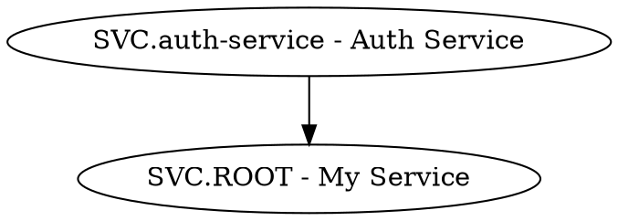

# Ontology CLI Companion Guide

Complete reference for the `~/.ontology-cli/` skill library.
Covers every skill from STORY-005 through STORY-024 with command signature,
parameters, example invocation, example output, and idempotency behaviour.

---

## Prerequisites

| Requirement      | Version / Detail                                    |
| ---------------- | --------------------------------------------------- |
| macOS            | 12 Monterey or later (Bash 3.2+)                    |
| Obsidian desktop | ≥ 1.12.4 (Bases feature required)                   |
| Obsidian CLI     | registered as `obsidian` on `$PATH` — see STORY-002 |
| Python 3         | system `/usr/bin/python3` (no packages needed)      |

### PATH setup

```bash
# Added by bootstrap-vault.sh to ~/.zprofile
export PATH="${HOME}/.ontology-cli/core:${HOME}/.ontology-cli/agent:${PATH}"
```

---

## Limitations

| ID  | Limitation                                                | Workaround                                                          |
| --- | --------------------------------------------------------- | ------------------------------------------------------------------- |
| L1  | Obsidian must be running                                  | Launch Obsidian before invoking any skill                           |
| L2  | Single vault per CLI session                              | Open the target vault in Obsidian before running skills             |
| L3  | CLI requires macOS                                        | No Linux/Windows support                                            |
| L4  | No web vault support                                      | Local vaults only; iCloud-synced vaults must be local               |
| L5  | One agent session per vault at a time                     | Multiple agents on the same vault cause race conditions             |
| L7  | Bases requires Obsidian open                              | `*.base` files render only in the Obsidian app                      |
| L8  | Daily note requires today's note to exist or be creatable | Create today's journal note before running skills that append to it |

> **L6 (iOS)** is out of scope — CLI skills are macOS-only.

---

## Core Skills

### `create-project.sh` — STORY-005

Scaffolds a complete project: ROOT note, `_ontology`, `_vocab`, `_topk`, and `.base` file.

```
create-project.sh <vault> <slug> "<Title>"
create-project.sh vault=<name> <slug> "<Title>"
```

**Parameters**

| Parameter | Description                                           |
| --------- | ----------------------------------------------------- |
| `vault`   | Vault name or `vault=<name>` keyword arg              |
| `slug`    | Project slug: lowercase alphanumeric, hyphens allowed |
| `Title`   | Human-readable project title                          |

**Creates (5 files)**

```
projects/<slug>/
  <SLUG>.ROOT - <Title>.md      type: ROOT, kind: concept, status: draft
  _ontology.<slug>.md           10-row default relationship type table
  _vocab.<slug>.md              vocabulary tracking table
  _topk.<slug>.md               overflow log scaffold
  <slug>.base                   Bases filter: file.inFolder("projects/<slug>")
```

**Example**

```bash
create-project.sh study aws "Amazon Web Services"
# → Created projects/aws/ with 5 files
```

**Idempotency** — exits 0 with no modifications if `projects/<slug>/` already exists.

---

### `create-entity.sh` — STORY-006

Creates a single typed note (LEAF, BRANCH, or ROOT) from the correct template,
wires it into the parent's `children:` array, and logs creation to the daily note.

```
create-entity.sh <vault> <project> <TYPE> <slug> "<Title>" <parent_slug> <kind> [<spine>] [--json]
create-entity.sh vault=<name> ...
```

**Parameters**

| Parameter     | Description                                            |
| ------------- | ------------------------------------------------------ |
| `TYPE`        | `LEAF`, `BRANCH`, or `ROOT`                            |
| `slug`        | Note slug within the project (lowercase, hyphens)      |
| `parent_slug` | Slug of the parent note (use `ROOT` for top-level)     |
| `kind`        | Knowledge kind: `concept`, `service`, `decision`, etc. |
| `spine`       | Optional; inherited from parent when omitted           |
| `--json`      | Emit `{"created":bool,"path":"...","title":"..."}`     |

**Example**

```bash
create-entity.sh study aws LEAF s3-overview "S3 Overview" ROOT concept aws
# → Created projects/aws/AWS.s3-overview - S3 Overview.md
# → Updated AWS.ROOT - Amazon Web Services.md children:[]
```

**Idempotency** — exits 0 with no modification if the note already exists.
On partial failure (note created, parent update fails) writes to `_inbox/_rollback-log.md`.

---

### `add-connection.sh` — STORY-007

Adds a typed connection to a source note's `## Connections` section and writes
the inverse on the target note automatically.

```
add-connection.sh <vault> "<source-path>" "<rel-type>" "<target-path>" ["<context>"]
add-connection.sh vault=<name> ...
```

**Parameters**

| Parameter     | Description                                                |
| ------------- | ---------------------------------------------------------- |
| `source-path` | Vault-relative path to the source note                     |
| `rel-type`    | Relationship type from the project's `_ontology.<slug>.md` |
| `target-path` | Vault-relative path to the target note                     |
| `context`     | Optional free-text context appended after `—`              |

**Example**

```bash
add-connection.sh study \
  "projects/aws/AWS.s3-overview - S3 Overview.md" \
  "depends-on" \
  "projects/aws/AWS.iam-basics - IAM Basics.md"
# Source gets: - depends-on :: [[AWS.iam-basics - IAM Basics]]
# Target gets: - dependency-of :: [[AWS.s3-overview - S3 Overview]]
```

**Idempotency** — checks for exact duplicate before appending; skips if already present.

---

### `import-json.sh` — STORY-008

Bulk-creates notes from a JSON array, skipping notes that already exist.

```
import-json.sh <vault|vault=name> <project_slug> <json_file> <template>
```

**JSON format**

```json
[
  { "name": "EC2 Instances", "type": "LEAF", "kind": "concept", "spine": "aws" },
  { "name": "VPC Networking", "type": "BRANCH", "kind": "concept", "spine": "aws" }
]
```

Standard fields: `name`, `type`, `kind`, `spine`. All extra fields are written
verbatim as frontmatter properties.

**Example**

```bash
import-json.sh study aws notes.json LEAF
# → Created: 12, Skipped: 3
```

**Idempotency** — notes that already exist are silently skipped.

---

### `cli-lint.sh` — STORY-009

Validates frontmatter completeness, structural rules, flag/tag hygiene,
connection typing, breadcrumb presence, and limit thresholds.

```
cli-lint.sh <vault> [<folder>] [--json]
cli-lint.sh vault=<name> [<folder>] [--json]
```

**Detected violations**

| Rule                 | Description                                                                             |
| -------------------- | --------------------------------------------------------------------------------------- |
| `missing-field`      | Required field absent: `title`, `type`, `kind`, `spine`, `status`, `created`, `aliases` |
| `root-has-parent`    | ROOT note has non-empty `parent:`                                                       |
| `missing-parent`     | BRANCH or LEAF has no `parent:`                                                         |
| `empty-children`     | BRANCH has empty `children: []`                                                         |
| `spine-in-body`      | Spine tag used in note body                                                             |
| `legacy-flag-tag`    | `#flag/` tag found in body                                                              |
| `legacy-status-tag`  | `#status/` tag found in body                                                            |
| `untyped-connection` | Connection line in `## Connections` not matching `:: [[`                                |
| `connection-limit`   | Connection count > 7                                                                    |
| `missing-breadcrumb` | BRANCH or LEAF missing `## Breadcrumb`                                                  |
| `flag-limit`         | Callout flag count > 3                                                                  |

**Excludes** `tpl-*`, `_vocab*`, `_topk*`, `_ontology*`.

**Example**

```bash
cli-lint.sh study projects/aws
# Lint complete. 3 issues in 45 notes.
# [WARN] AWS.s3-overview - S3 Overview.md: missing-field: aliases
# ...

cli-lint.sh study projects/aws --json
# {"vault":"study","folder":"projects/aws","issues":[...],"count":3}
```

**Exit codes** — 0 always (findings on stdout); 1 on script-level error only.

---

### `cli-orphans.sh` — STORY-010

Detects orphaned, broken, and mismatched parent–child relationships.

```
cli-orphans.sh <vault> [--json] [--project <slug>]
```

**Orphan types**

| Type       | Condition                                            |
| ---------- | ---------------------------------------------------- |
| `ORPHAN`   | BRANCH/LEAF with no `parent:` field                  |
| `BROKEN`   | `parent:` wikilink resolves to no file               |
| `MISMATCH` | Note lists parent P but P doesn't list note as child |

**Example**

```bash
cli-orphans.sh study --project aws
# ORPHAN  AWS.forgotten-note - Forgotten Note.md
# BROKEN  AWS.draft-idea - Draft Idea.md  (parent: [[AWS.missing-branch]] not found)
```

---

### `cli-relations.sh` — STORY-011

Enumerates all typed connections in a project as a source→rel→target edge list
and validates each type against `_ontology.<slug>.md`.

```
cli-relations.sh [vault=<name>] <slug> [--json]
```

**JSON output**

```json
{
  "edges": [
    {
      "source": "AWS.s3-overview - S3 Overview",
      "rel": "depends-on",
      "target": "AWS.iam-basics - IAM Basics",
      "context": ""
    }
  ],
  "summary": { "depends-on": 5, "part-of": 2 },
  "unknownTypes": ["refers-to"]
}
```

**Example**

```bash
cli-relations.sh vault=study aws --json | python3 -m json.tool
```

---

### `migrate.sh` — STORY-012

Applies bulk schema changes from a declarative JSON spec. Supports rename-rel,
rename-spine, add-field, and promote operations.

```
migrate.sh <vault> <project_slug> <spec_file> [--dry-run]
migrate.sh vault=<name> ...
```

**Spec format**

```json
[
  { "op": "rename-rel", "from": "triggers", "to": "activates" },
  { "op": "rename-spine", "from": "aws", "to": "cloud" },
  { "op": "add-field", "field": "reviewed", "value": false, "filter": { "type": "LEAF" } },
  { "op": "promote", "note": "AWS.s3-draft - S3 Draft" }
]
```

**Supported operations**

| `op`           | Effect                                                             |
| -------------- | ------------------------------------------------------------------ |
| `rename-rel`   | Rename a relationship type in all `## Connections` lines           |
| `rename-spine` | Update `spine:` frontmatter field across all notes                 |
| `add-field`    | Add a new frontmatter field with a default value (filter optional) |
| `promote`      | Change a LEAF note to BRANCH                                       |

`--dry-run` prints the planned changes without writing.

---

### `sync-topk.sh` — STORY-013

Appends overflow log rows to `_topk.<slug>.md` for any note exceeding
connection, callout-flag, or BRANCH-children limits.

```
sync-topk.sh <vault> <project_slug>
sync-topk.sh vault=<name> <project_slug>
```

**Thresholds**

| Field                    | Threshold |
| ------------------------ | --------- |
| `connections`            | > 7       |
| `callout-flags`          | > 3       |
| `children` (BRANCH only) | > 7       |

**Overflow log row format**

```
| date | [[note]] | field | count | threshold |
```

**Example**

```bash
sync-topk.sh study aws
# sync-topk: 45 note(s) scanned, 2 overflow row(s) appended to _topk.aws.md
```

**Idempotency** — deduplicates by note+field; re-running adds no duplicate rows.
Updates `updated:` frontmatter date on every run.
Warns (but does not error) when the log reaches 200 rows.

---

### `sync-ontology.sh` — STORY-014

Synchronises the project's `_ontology.<slug>.md` relationship type table with
the actual relations found across all notes.

```
sync-ontology.sh [vault=<name>] <slug> [--json]
```

**Example**

```bash
sync-ontology.sh vault=study aws
# sync-ontology: aws — 3 type(s) added, 0 removed
```

**Idempotency** — only appends new types; never removes existing rows.

---

### `sync-vocab.sh` — STORY-014

Synchronises `_vocab.<slug>.md` with terms collected from note titles and aliases.

```
sync-vocab.sh [vault=<name>] <slug> [--dry-run]
```

---

### `context.sh` — STORY-016

Primary sensory skill: relevance-scored vault retrieval.
Returns top N notes scored by a weighted multi-factor model.

```
context.sh <vault> "<query>" [<limit>]
context.sh vault=<name> "<query>" [<limit>]
```

**Scoring weights (per query term)**

| Factor              | Points                    |
| ------------------- | ------------------------- |
| Title match         | +10                       |
| Alias match         | +8                        |
| Kind match          | +5                        |
| Spine match         | +4                        |
| Tag match           | +3                        |
| Body term frequency | +1 per occurrence, cap +5 |

**Default limit** — 5 results.

**JSON output schema**

```json
{
  "query": "S3 lifecycle",
  "vault": "study",
  "results": [
    {
      "path": "projects/aws/AWS.s3-lifecycle - S3 Lifecycle Rules.md",
      "title": "S3 Lifecycle Rules",
      "type": "LEAF",
      "kind": "concept",
      "spine": "aws",
      "status": "evergreen",
      "parent": "[[AWS.s3-overview - S3 Overview]]",
      "children": [],
      "aliases": ["lifecycle policy"],
      "breadcrumb": "AWS.ROOT - Amazon Web Services > AWS.s3-overview - S3 Overview > AWS.s3-lifecycle - S3 Lifecycle Rules",
      "summary": "S3 lifecycle rules transition objects between storage classes...",
      "content": "...(truncated at 2000 chars)...",
      "connections": [
        { "rel": "depends-on", "target": "AWS.iam-basics - IAM Basics", "context": "" }
      ]
    }
  ]
}
```

**Example**

```bash
context.sh study "S3 lifecycle" 3
# → JSON with top 3 results
```

**Returns** `{"results":[]}` with exit 0 when no notes match. Never exits non-zero for empty results.
**Runtime** < 5 s for a 200-note vault (single `obsidian eval` IIFE, no per-file round trips).

---

### `get-entity.sh` — STORY-017

Deep single-note retrieval by exact or partial basename/alias match.

```
get-entity.sh <vault> "<search-term>"
get-entity.sh vault=<name> "<search-term>"
```

**Example**

```bash
get-entity.sh study "S3 Lifecycle Rules"
# → JSON with full entity detail
```

---

### `get-tree.sh` — STORY-018

Returns the complete hierarchical note tree for a project as nested JSON.
Traverses ROOT → BRANCH → LEAF via `children:` frontmatter arrays.

```
get-tree.sh <vault> <project_slug> [--depth <N>]
get-tree.sh vault=<name> <project_slug> [--depth <N>]
```

**JSON output schema**

```json
{
  "folder": "projects/aws",
  "nodeCount": 47,
  "tree": [
    {
      "path": "projects/aws/AWS.ROOT - Amazon Web Services.md",
      "title": "Amazon Web Services",
      "type": "ROOT",
      "kind": "concept",
      "status": "evergreen",
      "subtree": [
        {
          "path": "projects/aws/AWS.s3-overview - S3 Overview.md",
          "type": "BRANCH",
          "subtree": [{ "path": "...", "type": "LEAF", "subtree": [] }]
        },
        { "missing": "AWS.unresolved-ref" },
        { "cycle": "projects/aws/AWS.ROOT - Amazon Web Services.md" }
      ]
    }
  ]
}
```

**`--depth N`** — limit recursion depth (default: unlimited, hard cap 50).

**Missing children** → `{"missing":"<basename>"}` node.
**Cycles** → `{"cycle":"<path>"}` node; never recurses infinitely.

**Example**

```bash
get-tree.sh study aws --depth 2
```

---

### `get-knowledge-gap.sh` — STORY-019

Identifies structural deficiencies across a project: stubs, isolated nodes,
drafts, missing fields, low link counts, and unresolved links.

```
get-knowledge-gap.sh <vault> <project_slug>
get-knowledge-gap.sh vault=<name> <project_slug>
```

---

### `explain-topic.sh` — STORY-019

Assembles a teaching bundle for a queried topic: primary note, parent,
siblings, and connected notes' summaries.

```
explain-topic.sh <vault> <project_slug> "<topic>"
explain-topic.sh vault=<name> <project_slug> "<topic>"
```

---

## Dev Skills (`~/.ontology-cli/dev/`)

### `adr.sh` — STORY-023

Creates an Architecture Decision Record as a LEAF note with `kind: decision`,
`decision-date`, `decision-status: proposed`, and structured Content sections.

```
adr.sh <vault> <project_slug> "<title>" [<parent_slug>]
adr.sh vault=<name> <project_slug> "<title>" [<parent_slug>]
```

**Auto-generated slug** — `adr-YYYYMMDD-<slugified-title>`

**Frontmatter additions** (on top of standard LEAF fields)

```yaml
kind: decision
decision-date: 2026-03-25
decision-status: proposed
```

**Content structure**

```markdown
## Content

### Context

_What problem or force is driving this decision?_

### Decision

_What was decided? State it as a full sentence._

### Consequences

_What are the resulting trade-offs, risks, and obligations?_
```

**Example**

```bash
adr.sh dev-projectA svc "Use PostgreSQL for session storage"
# ADR created: projects/svc/SVC.adr-20260325-use-postgresql-for-session-storage - Use PostgreSQL for session storage.md
#   decision-date:   2026-03-25
#   decision-status: proposed
```

**Idempotency** — delegates to `create-entity.sh`; exits 0 if note already exists.
Delegates fully to `create-entity.sh` — ADRs comply with all entity creation rules.

---

### `dependency-map.sh` — STORY-023

Filters the full relationship graph to `depends-on` edges only.

```
dependency-map.sh <vault> <project_slug> [--format json|dot]
dependency-map.sh vault=<name> <project_slug> [--format json|dot]
```

**JSON output**

```json
{
  "project": "svc",
  "edges": [
    {
      "source": "SVC.auth-service - Auth Service",
      "target": "SVC.ROOT - My Service",
      "context": ""
    }
  ]
}
```

**DOT output** (`--format dot`)



**Example**

```bash
dependency-map.sh dev-projectA svc
dependency-map.sh dev-projectA svc --format dot | dot -Tsvg > deps.svg
```

---

### `code-link.sh` — STORY-023

Appends a code-path reference to a note's `## Connections` section.

```
code-link.sh <vault> "<note-path>" "<code-path>"
code-link.sh vault=<name> "<note-path>" "<code-path>"
```

**Appends**

```markdown
- implements :: `src/auth/handler.ts`
```

**Security** — rejects code paths containing `]]` or newlines.

**Example**

```bash
code-link.sh dev-projectA \
  "projects/svc/SVC.auth-service - Auth Service.md" \
  "src/auth/handler.ts"
# code-link: appended to projects/svc/SVC.auth-service - Auth Service.md
#   - implements :: `src/auth/handler.ts`
```

**Idempotency** — checks for exact code-path string before appending; re-running exits 0 with "already present".

---

## Study Skills (`~/.ontology-cli/study/`)

Study skills (STORY-022) are implemented in `~/.ontology-cli/study/`:
`quiz.sh`, `coverage.sh`, `progress.sh`. See STORY-022 for details.

---

## `_inbox/_rollback-log.md` Recovery Workflow

The `rollback_log` function in `lib.sh` writes to `_inbox/_rollback-log.md`
when a skill fails after partial execution. Each entry records a timestamp,
operation name, and partial state.

**Format**

```markdown
| Timestamp | Operation | Partial State |
|...|...|...|
| 2026-03-25T14:30:00Z | create-entity | projects/aws/AWS.draft - Draft.md created; parent update failed |
```

**Recovery steps**

1. Open `_inbox/_rollback-log.md` in Obsidian.
2. For each entry, identify the partially completed operation.
3. If the partial file exists and is unlinked: either delete it or manually add it to the parent's `children:` array.
4. Re-run the original skill command once the underlying issue is resolved.
5. The Auditor subagent includes `_inbox/_rollback-log.md` in its triage scope and will surface unresolved entries during weekly review.

---

## Cross-References

| Document                | Location                         | Contents                                             |
| ----------------------- | -------------------------------- | ---------------------------------------------------- |
| v11 framework reference | `docs/obsidian_documentation.md` | Obsidian features, CLI registration, vault structure |
| This guide              | `docs/cli-guide.md`              | All CLI skill signatures, parameters, examples       |
| Agent routing patterns  | `cli/agent/patterns.md`          | Subagent decision trees, skill registry, limitations |
| Story plans             | `docs/plan/STORY-*.md`           | Per-story acceptance criteria, design notes          |
