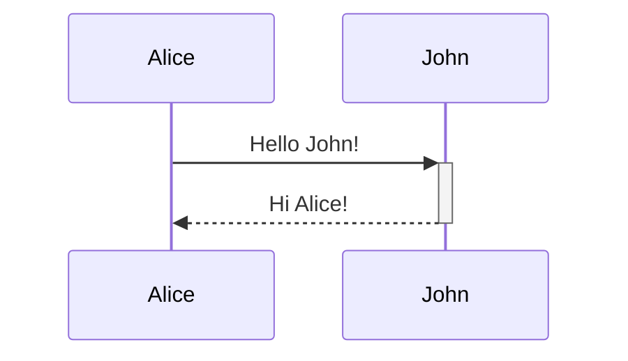

# Obsidian Complete Reference

Comprehensive reference for all core Obsidian features: vaults, formatting, linking, properties, Bases, plugins, and the macOS CLI.
For: Obsidian power users, knowledge engineers, and developers building vault-based workflows.

---

## Table of contents

1. [Vaults](#1-vaults)
2. [Files and folders](#2-files-and-folders)
3. [Editing and formatting](#3-editing-and-formatting)
4. [Properties](#4-properties)
5. [Tags](#5-tags)
6. [Linking notes and files](#6-linking-notes-and-files)
7. [Bases](#7-bases)
8. [Core plugins](#8-core-plugins)
9. [Obsidian CLI (macOS)](#9-obsidian-cli-macos)

---

## 1. Vaults

A **vault** is a folder on your local file system where Obsidian stores notes as plain-text Markdown files.
Obsidian creates a hidden `.obsidian` folder inside each vault to store settings, plugins, themes, and snippets.
Because vaults are ordinary folders, you own the data completely — no proprietary format, no lock-in.

### 1.1 Create a vault

**New empty vault**

1. Open Obsidian. The Vault Switcher opens on first launch.
2. Select **Create new vault → Create**.
3. Enter a vault name.
4. Click **Browse** to choose a location on disk.
5. Click **Create**.

**Open an existing folder**

1. In the Vault Switcher, click **Open folder as vault → Open**.
2. Select the target folder.
Obsidian creates the `.obsidian` configuration folder inside it.

**Mobile (iOS)**

1. Open Obsidian and tap **Create new vault**.
2. Enter a name.
3. Toggle **Store in iCloud** to enable iCloud sync.
4. Tap **Create**.

### 1.2 The sandbox vault

The **sandbox vault** ships with Obsidian desktop and lets you test features, plugins, and themes without affecting real data.
If a problem does not reproduce in the sandbox, a community plugin or theme is likely the cause.

Open the sandbox via **Command Palette → Open sandbox vault**, or via the **Help** icon in the left sidebar.

> [!note]
> The sandbox vault is not available on mobile. Download a copy from the [obsidian-help GitHub repository](https://github.com/obsidianmd/obsidian-help) if needed.

### 1.3 Manage vaults

Access vault management via the **Vault profile** icon at the bottom of the left sidebar, or via **Command Palette → Open another vault**.

| Action           | Steps                                                                   |
| ---------------- | ----------------------------------------------------------------------- |
| Rename vault     | Vault profile → Manage Vaults → ⋯ → Rename vault                       |
| Move vault       | Vault profile → Manage Vaults → ⋯ → Move vault (then select new path)  |
| Remove from list | Vault profile → Manage Vaults → ⋯ → Remove from list (files unchanged) |
| Copy settings    | Copy `.obsidian` folder from source vault root to destination vault root |

> [!warning]
> Do not create a vault inside the Obsidian system settings folder — this can cause data corruption.

### 1.4 Import notes from other apps

Install the **Importer** community plugin (**Settings → Community plugins → Browse → Importer**), then run **Importer: Open Importer**.

| Source format    | Notes                                                                                             |
| ---------------- | ------------------------------------------------------------------------------------------------- |
| Apple Notes      | macOS only; reads local SQLite database; converts text, tables, images, PDFs, checklists          |
| CSV              | Each row becomes a note; columns map to frontmatter; configure name/content/property columns       |
| Markdown         | Converts non-standard link formats to wiki-links; or copy `.md` files directly if no conversion needed |
| HTML             | Extracts text, converts to Markdown, saves embedded images as attachments                          |
| Evernote / Notion / Roam / Bear / Google Keep | Supported via the same Importer plugin |

**Apple Notes import steps**

1. Ensure notes are synced locally in the Notes app before importing.
2. Run **Importer: Open Importer** → choose **Apple Notes**.
3. Select an output folder inside your vault.
4. Click **Import**.

**CSV import steps**

1. Run **Importer: Open Importer** → choose **CSV**.
2. Select your `.csv` file.
3. Set the **Note name column**, **Note content column**, and any frontmatter columns.
4. Click **Import**.

### 1.5 Sync across devices

> [!important]
> Never run two sync services on the same vault simultaneously — this causes conflicts and data corruption.

| Method           | Platforms           | Cost                  |
| ---------------- | ------------------- | --------------------- |
| Obsidian Sync    | All                 | Paid subscription     |
| iCloud           | macOS, iOS          | Free (Apple ID)       |
| OneDrive         | Windows, macOS      | Free tier available   |
| Google Drive     | Windows, macOS, Android | Free tier available |
| Syncthing        | Windows, macOS, Linux | Free / open-source  |
| Git              | All (manual)        | Free                  |

**iCloud setup (recommended for Apple users)**

1. Enable iCloud Drive on all devices: **System Settings → Apple ID → iCloud → iCloud Drive**.
2. Create the vault on iPhone first with **Store in iCloud** toggled on — this creates `iCloud Drive/Obsidian/<VaultName>`.
3. On your Mac, open the vault via **Vault Switcher → Open folder as vault** → navigate to `iCloud Drive → Obsidian → <VaultName>`.
4. Right-click the Obsidian folder in Finder → **Keep Downloaded** to prevent file offloading.

### 1.6 Back up your vault

Sync services are not backups — they replicate deletions instantly.
Use at least one off-device, point-in-time backup.

| Method              | Notes                                                             |
| ------------------- | ----------------------------------------------------------------- |
| Time Machine (macOS) | Continuous local backup of the entire vault folder              |
| Backblaze / Carbonite | Cloud backup with version history                              |
| External drive       | Manual copy; simple but can be lost or damaged                  |
| Obsidian Git plugin  | Commits vault to a Git repo on a schedule; full version history |

Back up the entire vault folder, including `.obsidian`.

---

## 2. Files and folders

### 2.1 Accepted file formats

| Category  | Extensions                                               |
| --------- | -------------------------------------------------------- |
| Markdown  | `.md`                                                    |
| Bases     | `.base`                                                  |
| Canvas    | `.canvas`                                                |
| Images    | `.avif`, `.bmp`, `.gif`, `.jpeg`, `.jpg`, `.png`, `.svg`, `.webp` |
| Audio     | `.flac`, `.m4a`, `.mp3`, `.ogg`, `.wav`, `.webm`, `.3gp` |
| Video     | `.mkv`, `.mov`, `.mp4`, `.ogv`, `.webm`                  |
| PDF       | `.pdf`                                                   |

Community plugins extend support for additional formats.

### 2.2 The configuration folder

The `.obsidian` folder sits at the vault root and stores all vault-specific settings.

**Reveal the `.obsidian` folder on macOS**

Press `Cmd+Shift+.` in Finder to show hidden files.

**Change the configuration folder**

1. Open **Settings → Files and Links → Override config folder**.
2. Enter a name starting with `.` (e.g., `.obsidian-work`).
3. Relaunch Obsidian.

**Global settings location (macOS)**

```text
~/Library/Application Support/obsidian
```

**Git users** — add these files to `.gitignore` to avoid noisy diffs:

```text
.obsidian/workspace.json
.obsidian/workspaces.json
```

### 2.3 Manage notes

| Action        | Method                                                              |
| ------------- | ------------------------------------------------------------------- |
| Create note   | `Cmd+N`, or File Explorer → right-click folder → New note           |
| Rename note   | Click note title or press `F2`; all links update automatically      |
| Delete note   | More options → Delete file, or Command Palette → Delete current file |
| Deleted files | Controlled via **Settings → Files & Links → Deleted files**         |

**Deleted file destinations**

| Option              | Behavior                                              |
| ------------------- | ----------------------------------------------------- |
| System trash        | Default. Restore via the OS trash / Finder            |
| Obsidian trash      | Moves to `.trash` folder inside the vault             |
| Permanently delete  | Immediate, irreversible deletion                      |

---

## 3. Editing and formatting

Obsidian uses **Obsidian Flavored Markdown (OFM)** — a superset combining CommonMark, GitHub Flavored Markdown, LaTeX, and Obsidian-specific extensions.

### 3.1 Text formatting

| Style              | Syntax                    |
| ------------------ | ------------------------- |
| **Bold**           | `**text**` or `__text__`  |
| *Italic*           | `*text*` or `_text_`      |
| ~~Strikethrough~~  | `~~text~~`                |
| ==Highlight==      | `==text==`                |
| `Inline code`      | `` `code` ``              |
| Bold + italic      | `***text***`              |

To display a formatting character literally, prefix it with `\`.

### 3.2 Headings

```markdown
# Heading 1
## Heading 2
### Heading 3
#### Heading 4
##### Heading 5
###### Heading 6
```

Headings become anchor points — link directly to them with `[[Note#Heading]]`.

### 3.3 Lists

**Unordered** — use `-`:

```markdown
- Item one
- Item two
  - Nested item
```

**Ordered** — use `1.` for every item:

```markdown
1. First
1. Second
   1. Nested
```

**Task lists**:

```markdown
- [x] Completed task
- [ ] Incomplete task
```

Click a checkbox in Reading or Live Preview mode to toggle it.
Press `Tab` / `Shift+Tab` to adjust nesting.

### 3.4 Code

**Inline code** — wrap with single backticks: `` `print()` ``

**Fenced code blocks** — specify a language for syntax highlighting:

````markdown
```python
def hello():
    print("Hello, world!")
```
````

Obsidian uses **Prism** for syntax highlighting in Reading view.

**Nesting code blocks** — use four or more backticks for the outer block:

`````markdown
````markdown
```js
console.log("hello")
```
````
`````

### 3.5 Tables

```markdown
| First name | Last name |
| ---------- | --------- |
| Max        | Planck    |
| Marie      | Curie     |
```

**Column alignment** — add `:` to the separator row:

```markdown
| Left-aligned | Center-aligned | Right-aligned |
| :----------- | :------------: | ------------: |
| Content      | Content        | Content       |
```

**Pipes inside cells** — escape with `\`:

```markdown
| Column 1         |
| ---------------- |
| [[Page\|Alias]]  |
```

In Live Preview, right-click any table to add/delete rows and columns.

### 3.6 Callouts

```markdown
> [!info]
> This is a callout block. Supports **Markdown** and [[Wikilinks]].
```

**Custom title**:

```markdown
> [!tip] Custom title text
> Body content here.
```

**Foldable** — add `+` (starts open) or `-` (starts collapsed) after the type:

```markdown
> [!faq]- Collapsed by default
> Hidden until clicked.
```

**Supported callout types**

| Type identifier(s)              | Purpose                          |
| ------------------------------- | -------------------------------- |
| `note`                          | General notes                    |
| `abstract`, `summary`, `tldr`   | Summaries                        |
| `info`                          | Informational content            |
| `todo`                          | Action items                     |
| `tip`, `hint`, `important`      | Tips and important points        |
| `success`, `check`, `done`      | Success states                   |
| `question`, `help`, `faq`       | Questions and FAQs               |
| `warning`, `caution`, `attention` | Warnings                       |
| `failure`, `fail`, `missing`    | Failure states                   |
| `danger`, `error`               | Errors                           |
| `bug`                           | Bug reports                      |
| `example`                       | Examples                         |
| `quote`, `cite`                 | Quotations                       |

Type identifiers are case-insensitive. Any unknown type renders as `note`.

**Nested callouts** — add extra `>` prefixes:

```markdown
> [!warning] Outer
>> [!tip] Inner
>> Nested content.
```

**Custom callout types** — define in `.obsidian/snippets/custom.css`:

```css
.callout[data-callout="my-type"] {
  --callout-color: 120, 180, 60;
  --callout-icon: lucide-star;
}
```

### 3.7 Advanced formatting

**Blockquotes**:

```markdown
> Quoted text goes here.
> Multiple lines work fine.
```

**Horizontal rule** — use `---`, `***`, or `___` on their own line.

**Footnotes**:

```markdown
This is a footnote[^1].

[^1]: The footnote text.
```

**Inline footnote**:

```markdown
This has an inline footnote.^[Inline content here.]
```

**Comments** (hidden in Reading view):

```markdown
%%This comment is invisible in preview.%%
```

**Math — inline**:

```markdown
The formula $E = mc^2$ is well known.
```

**Math — block**:

```markdown
$$
\frac{-b \pm \sqrt{b^2 - 4ac}}{2a}
$$
```

**Mermaid diagrams**:

````markdown

````

### 3.8 HTML in notes

Obsidian sanitizes all HTML — `<script>` and event handler attributes are stripped.
Markdown syntax inside HTML block elements does **not** render; use HTML tags instead.

**Common HTML patterns**:

```html
<u>Underlined text</u>
<sub>subscript</sub>  <sup>superscript</sup>
<center>Centered content</center>

<details>
<summary>Expandable section</summary>
Hidden content here.
</details>

<!-- Portable HTML comment -->
```

**Embed a web page**:

```html
<iframe src="https://example.com" width="100%" height="500"></iframe>
```

### 3.9 Attachments

**Default attachment location** — configure at **Settings → Files & Links → Default location for new attachments**:

| Option                        | Behavior                                          |
| ----------------------------- | ------------------------------------------------- |
| Vault folder                  | Saves to vault root                               |
| In the folder specified below | Saves to a fixed path                             |
| Same folder as current file   | Saves alongside the current note                  |
| In subfolder under current folder | Saves in a named subfolder next to the note   |

Add attachments by dragging a file into an open note on desktop.

---

## 4. Properties

**Properties** (frontmatter) store structured, typed metadata in YAML at the top of a file.

```yaml
---
title: My Note
date: 2025-04-15
tags:
  - meeting
  - project
aliases:
  - Alternate Name
cssclasses:
  - wide-page
---
```

### 4.1 Add properties

| Method             | Action                                                   |
| ------------------ | -------------------------------------------------------- |
| Command Palette    | "Add file property"                                      |
| Keyboard shortcut  | `Cmd+;`                                                  |
| More actions menu  | Click the three-dot menu on a tab                        |
| Manual             | Type `---` at the very beginning of the file             |

### 4.2 Property types

A property name's type is **vault-wide** — all notes sharing a name use the same type.

| Type          | Description                        | Example                         |
| ------------- | ---------------------------------- | ------------------------------- |
| Text          | Single-line string                 | `status: draft`                 |
| List          | Multiple values                    | `tags:\n  - one\n  - two`       |
| Number        | Integer or decimal                 | `rating: 4.5`                   |
| Checkbox      | Boolean                            | `completed: true`               |
| Date          | ISO 8601                           | `date: 2025-04-15`              |
| Date & Time   | Date with time                     | `created: 2025-04-15T14:30:00`  |
| Tags          | Special type for the `tags` key    | `tags:\n  - meeting`            |

### 4.3 Built-in properties

| Property     | Type     | Purpose                                              |
| ------------ | -------- | ---------------------------------------------------- |
| `tags`       | Tags     | Note categorization; equivalent to inline `#tags`    |
| `aliases`    | List     | Alternative names for link suggestions and search    |
| `cssclasses` | List     | CSS class names applied to the note                  |
| `publish`    | Checkbox | Obsidian Publish: whether the note is published      |
| `permalink`  | Text     | Obsidian Publish: custom URL path                    |
| `description`| Text     | Obsidian Publish: meta description                   |

> [!note]
> `tag`, `alias`, and `cssclass` are deprecated since Obsidian 1.4. Use the plural forms above instead. The Format Converter plugin can bulk-convert deprecated properties.

### 4.4 Display modes

Configure via **Settings → Editor → Properties in document**:

| Mode    | Behavior                                              |
| ------- | ----------------------------------------------------- |
| Visible | Formatted UI at top of note (default)                 |
| Hidden  | Hidden in editor; accessible via Properties view pane |
| Source  | Raw YAML frontmatter displayed as text                |

### 4.5 Property navigation hotkeys

| Action                  | Hotkey                       |
| ----------------------- | ---------------------------- |
| Focus next property     | `↓` or `Tab`                 |
| Focus previous property | `↑` or `Shift+Tab`           |
| Jump to editor          | `Alt+↓`                      |
| Edit property name      | `←`                          |
| Edit property value     | `→`                          |
| Focus property          | `Esc` (from editing)         |
| Delete property         | `Cmd+Backspace`              |
| Select all              | `Cmd+A`                      |

### 4.6 Search by property

```text
[property:value]
[status:completed]
[tags:meeting]
```

### 4.7 Properties view plugin

The **Properties view** core plugin provides vault-wide property management.
Right-click any property in the All Properties panel to rename it globally or change its type.
Renaming propagates to every note in the vault.

---

## 5. Tags

Tags are keywords that categorize notes independently of folder structure.

### 5.1 Create tags

**Inline**:

```markdown
#meeting #project/alpha
```

**Frontmatter**:

```yaml
---
tags:
  - meeting
  - project/alpha
---
```

### 5.2 Tag naming rules

- Use alphanumeric characters, `_`, `-`, and `/`.
- Include at least one non-numeric character (`#123` alone is invalid).
- Tags are case-insensitive.

### 5.3 Nested tags

Use `/` to create hierarchical taxonomies:

```text
#project/alpha
#project/beta
#recipe/dinner/italian
```

Searching `#project` returns notes tagged with `#project/alpha` and `#project/beta`.

### 5.4 Find and browse tags

| Method      | How                                          |
| ----------- | -------------------------------------------- |
| Search pane | `tag:#tagname`                               |
| Tags view   | Enable in **Settings → Core Plugins**        |
| Graph view  | Filter and group nodes by tag                |
| Bases       | Use `file.hasTag("tagname")` in filters      |

### 5.5 Tags vs. links

Use **tags** for shared attributes (note type, status, broad category).
Use **links** for direct relationships between specific notes.

---

## 6. Linking notes and files

### 6.1 Link formats

Obsidian supports two interchangeable formats:

| Format     | Syntax                                               |
| ---------- | ---------------------------------------------------- |
| Wikilink   | `[[Note Name]]`                                      |
| Markdown   | `[Note Name](Note%20Name.md)`                        |

Switch to Markdown links at **Settings → Files and Links → Use [[Wikilinks]]** (off).
Typing `[[` still triggers autocomplete in both modes.

> [!note]
> In Markdown format, URL-encode the destination path (spaces become `%20`). Avoid these characters in filenames: `# | ^ : %% [[ ]]`.

### 6.2 Link targets

**Link to a note**:

```markdown
[[Three laws of motion]]
```

**Link to a heading**:

```markdown
[[About Obsidian#Links are first-class citizens]]
```

**Link to a heading in the current note**:

```markdown
[[#Preview a linked file]]
```

**Link to a block**:

```markdown
[[2023-01-01#^37066d]]
```

**Search all headings vault-wide**:

```markdown
[[## team]]
```

### 6.3 Display text

**Wikilink**:

```markdown
[[Example|Custom label]]
[[Example#Details|Section label]]
```

**Markdown**:

```markdown
[Custom label](Example.md)
```

### 6.4 Block references

Add a block identifier at the end of any paragraph:

```markdown
This is a paragraph. ^my-block-id
```

For structured blocks (lists, blockquotes), place the ID on its own line with blank lines around it:

```markdown
> A blockquote.

^my-quote-id
```

Block identifiers use only Latin letters, numbers, and dashes.
Type `[[Note#^` to browse available blocks via autocomplete.

> [!note]
> Block references are Obsidian-specific and will not resolve outside Obsidian.

### 6.5 Aliases

Aliases are reusable alternative names for a note, defined in frontmatter:

```yaml
---
aliases:
  - AI
  - Artificial Intelligence
---
```

Link via alias — Obsidian autocomplete shows aliases with a ↩ icon and generates `[[Actual Note|Alias]]` format.

The **Backlinks** plugin surfaces unlinked mentions of aliases, which can be converted to formal links.

### 6.6 Embedding files

Prefix any wikilink with `!` to embed its content inline:

```markdown
![[Note Name]]                    # Embed entire note
![[Note Name#Heading]]            # Embed a section
![[Note Name#^block-id]]          # Embed a block
![[image.png]]                    # Embed image
![[image.png|300]]                # Embed image at 300px width
![[image.png|640x480]]            # Embed image at exact dimensions
![[audio.mp3]]                    # Embed audio player
![[Document.pdf]]                 # Embed PDF viewer
![[Document.pdf#page=3]]          # Embed PDF at specific page
![[Document.pdf#height=400]]      # Embed PDF with fixed height
```

**Embed live search results**:

````markdown
```query
tag:#project
```
````

### 6.7 Key link settings

All under **Settings → Files and Links**:

| Setting                           | Description                                    |
| --------------------------------- | ---------------------------------------------- |
| Use [[Wikilinks]]                 | Toggle link format                             |
| Automatically update internal links | Auto-update links on file rename             |
| New link format                   | Shortest path / relative path / absolute path  |
| Default location for new attachments | Where dragged/pasted files are stored        |
| Excluded files                    | Glob patterns deprioritized in autocomplete    |

---

## 7. Bases

**Bases** (Obsidian 1.9+) is a core plugin that turns any set of notes into a queryable database.
Bases are stored as `.base` files using YAML syntax and are backed by Markdown frontmatter.

Enable at **Settings → Core plugins → Bases**.

### 7.1 Create a base

| Method           | Action                                                              |
| ---------------- | ------------------------------------------------------------------- |
| Command Palette  | "Bases: Create new base" or "Bases: Insert new base"                |
| File Explorer    | Right-click a folder → New base                                     |
| Ribbon           | Click the Create new base icon                                      |

**Embed a base in a note**:

```markdown
![[MyBase.base]]            ← first view by default
![[MyBase.base#ViewName]]   ← specific named view
```

**Embed as a code block**:

````markdown
```base
filters:
  and:
    - file.hasTag("example")
views:
  - type: table
    name: Table
```
````

### 7.2 Base file structure

A `.base` file has four top-level sections: `filters`, `formulas`, `properties`, and `views`.

```yaml
filters:
  or:
    - file.hasTag("book")
    - file.hasLink("Textbook")
formulas:
  reading_time: 'if(pages, (pages * 2).toString() + " min", "")'
properties:
  author:
    displayName: Author
  formula.reading_time:
    displayName: Est. Time
summaries:
  customAverage: 'values.mean().round(3)'
views:
  - type: table
    name: Reading List
    limit: 20
    groupBy:
      property: status
      direction: ASC
    filters:
      and:
        - 'status != "done"'
    order:
      - file.name
      - author
      - formula.reading_time
    summaries:
      formula.reading_time: Average
```

### 7.3 Filters

By default, a base includes every file in the vault.
Filters narrow results. They apply at two levels: **global** (all views) and **view-level** (one view only), concatenated with AND.

```yaml
# Single filter
filters: 'status == "done"'

# AND
filters:
  and:
    - 'status == "done"'
    - 'priority > 3'

# OR
filters:
  or:
    - file.hasTag("book")
    - file.hasTag("article")

# NOT
filters:
  not:
    - file.hasTag("archived")

# Nested
filters:
  or:
    - file.hasTag("active")
    - and:
        - file.inFolder("Projects")
        - 'status != "cancelled"'
```

### 7.4 Formulas

Formulas define computed properties available across all views.

```yaml
formulas:
  total: "price * quantity"
  status_icon: 'if(done, "✅", "⏳")'
  formatted_price: 'if(price, "$" + price.toFixed(2), "")'
  created: 'file.ctime.format("YYYY-MM-DD")'
  days_old: '(now() - file.ctime).days'
  days_until_due: 'if(due_date, (date(due_date) - today()).days, "")'
  overdue: 'if(due_date < now() && status != "Done", "Overdue", "")'
  last_updated: 'file.mtime.relative()'
  link_count: 'file.links.length'
  is_daily: '/^\d{4}-\d{2}-\d{2}$/.matches(file.name)'
  word_estimate: '(file.size / 5).round(0)'
```

**Property reference prefixes**:

| Prefix              | Resolves to              | Example                     |
| ------------------- | ------------------------ | --------------------------- |
| *(none)* or `note.` | Frontmatter property     | `price`, `note.author`      |
| `file.`             | File system property     | `file.name`, `file.mtime`   |
| `formula.`          | Another formula          | `formula.formatted_price`   |

Formulas may reference other formulas (no circular references).
Wrap formulas containing double-quoted strings in single quotes, and vice versa.
Access hyphenated property names with bracket notation: `note["release-date"]`.

### 7.5 File properties

| Property          | Type   | Description                            |
| ----------------- | ------ | -------------------------------------- |
| `file.name`       | String | Filename without extension             |
| `file.path`       | String | Full file path                         |
| `file.folder`     | String | Parent folder path                     |
| `file.ext`        | String | File extension                         |
| `file.size`       | Number | Size in bytes                          |
| `file.ctime`      | Date   | Created time                           |
| `file.mtime`      | Date   | Modified time                          |
| `file.tags`       | List   | All tags (inline + frontmatter)        |
| `file.links`      | List   | All internal links                     |
| `file.backlinks`  | List   | Backlink files (slow; prefer links)    |
| `file.embeds`     | List   | All embeds                             |
| `file.properties` | Object | All frontmatter properties             |

### 7.6 The `this` object

`this` provides context-dependent access to the current file:

| Context                          | `this` refers to                             |
| -------------------------------- | -------------------------------------------- |
| Base opened in main content area | The base file itself                         |
| Base embedded in another note    | The embedding note                           |
| Base in a sidebar                | The currently active file in the main area   |

**Sidebar backlinks pattern**:

```yaml
filters:
  file.hasLink(this.file)
views:
  - type: list
    name: Backlinks
```

### 7.7 Views

| Type    | Description                                    | Available from |
| ------- | ---------------------------------------------- | -------------- |
| `table` | Rows and columns with properties as columns    | 1.9            |
| `cards` | Gallery grid with optional cover images        | 1.9            |
| `list`  | Bulleted or numbered list                      | 1.10           |
| `map`   | Pins on interactive map (requires Maps plugin) | 1.10           |

**View configuration keys**:

| Key       | Description                                           |
| --------- | ----------------------------------------------------- |
| `type`    | View type: `table`, `cards`, `list`, `map`            |
| `name`    | Tab display name                                      |
| `limit`   | Maximum number of results                             |
| `filters` | View-specific filters (same syntax as global)         |
| `groupBy` | `property` and `direction` (`ASC` / `DESC`)           |
| `order`   | List of property names defining column order          |
| `summaries` | Maps property names to summary formula names        |

**Cards view additional settings**:

| Setting            | Description                                               |
| ------------------ | --------------------------------------------------------- |
| `imageProperty`    | Property used as cover image (link, URL, or hex color)    |
| Image fit          | `Cover` (fill, may crop) or `Contain` (no crop)           |
| Image aspect ratio | Default 1:1                                               |

**Map view configuration**:

```yaml
views:
  - type: map
    name: Locations
    lat: latitude
    long: longitude
    title: file.name
```

### 7.8 Summaries

```yaml
summaries:
  customAverage: 'values.mean().round(3)'
```

**Built-in summary formulas**:

| Name      | Input type | Description           |
| --------- | ---------- | --------------------- |
| Average   | Number     | Mathematical mean     |
| Min       | Number     | Smallest number       |
| Max       | Number     | Largest number        |
| Sum       | Number     | Sum of all values     |
| Range     | Number     | Max − Min             |
| Median    | Number     | Mathematical median   |
| Stddev    | Number     | Standard deviation    |
| Earliest  | Date       | Earliest date         |
| Latest    | Date       | Latest date           |
| Range     | Date       | Latest − Earliest     |
| Checked   | Boolean    | Count of `true`       |
| Unchecked | Boolean    | Count of `false`      |
| Empty     | Any        | Count of empty values |
| Filled    | Any        | Count of non-empty    |
| Unique    | Any        | Count of unique       |

### 7.9 Operators

**Arithmetic**: `+` `-` `*` `/` `%` `( )` — must be surrounded by spaces.

**Comparison**: `==` `!=` `>` `<` `>=` `<=`

**Boolean**: `!` `&&` `||`

**Date arithmetic**:

```yaml
# Add or subtract durations
filters: 'file.mtime > now() - "1 week"'
```

| Unit   | Aliases                     |
| ------ | --------------------------- |
| Year   | `y`, `year`, `years`        |
| Month  | `M`, `month`, `months`      |
| Week   | `w`, `week`, `weeks`        |
| Day    | `d`, `day`, `days`          |
| Hour   | `h`, `hour`, `hours`        |
| Minute | `m`, `minute`, `minutes`    |
| Second | `s`, `second`, `seconds`    |

### 7.10 Functions reference

**Global functions**

| Function       | Signature                        | Description                              |
| -------------- | -------------------------------- | ---------------------------------------- |
| `date()`       | `date(string): date`             | Parse `"YYYY-MM-DD HH:mm:ss"` string     |
| `duration()`   | `duration(string): duration`     | Parse duration string (e.g., `"1d"`)     |
| `if()`         | `if(cond, trueVal, falseVal?)`   | Conditional; `falseVal` defaults to null |
| `now()`        | `now(): date`                    | Current date and time                    |
| `today()`      | `today(): date`                  | Current date (time set to 00:00:00)      |
| `number()`     | `number(any): number`            | Convert to number                        |
| `list()`       | `list(element): List`            | Wrap element in a list                   |
| `link()`       | `link(path, display?): Link`     | Create a link                            |
| `image()`      | `image(path): image`             | Render image from path or URL            |
| `icon()`       | `icon(name): icon`               | Render a Lucide icon                     |
| `html()`       | `html(string): html`             | Render string as HTML                    |
| `max()`        | `max(n1, n2, ...): number`       | Largest of provided numbers              |
| `min()`        | `min(n1, n2, ...): number`       | Smallest of provided numbers             |

**String functions**

| Function                     | Description                                  |
| ---------------------------- | -------------------------------------------- |
| `string.lower()`             | Convert to lowercase                         |
| `string.title()`             | Convert to Title Case                        |
| `string.trim()`              | Remove leading/trailing whitespace           |
| `string.contains(value)`     | True if contains substring                   |
| `string.startsWith(query)`   | True if starts with query                    |
| `string.endsWith(query)`     | True if ends with query                      |
| `string.replace(pat, repl)`  | Replace occurrences                          |
| `string.split(sep, n?)`      | Split into list; optional limit n            |
| `string.slice(start, end?)`  | Substring from start to end                  |
| `string.isEmpty()`           | True if empty or not present                 |
| `string.length`              | Character count                              |

**Number functions**

| Function               | Description                                   |
| ---------------------- | --------------------------------------------- |
| `number.abs()`         | Absolute value                                |
| `number.ceil()`        | Round up                                      |
| `number.floor()`       | Round down                                    |
| `number.round(digits?)`| Round to integer or n decimal places          |
| `number.toFixed(n)`    | Fixed-point string (`3.14159.toFixed(2)` → `"3.14"`) |
| `number.isEmpty()`     | True if not present                           |

**Date functions**

| Function               | Description                                        |
| ---------------------- | -------------------------------------------------- |
| `date.format(fmt)`     | Format with Moment.js string (e.g., `"YYYY-MM-DD"`) |
| `date.relative()`      | Human-readable relative time (e.g., `"3 days ago"`) |
| `date.date()`          | Remove time portion                               |
| `date.time()`          | Return time as string (e.g., `"23:59:59"`)         |
| `date.isEmpty()`       | Always returns `false`                             |
| `date.year`, `.month`, `.day`, `.hour`, `.minute`, `.second` | Date fields |

**List functions**

| Function                | Description                                         |
| ----------------------- | --------------------------------------------------- |
| `list.contains(value)`  | True if list contains value                         |
| `list.filter(expr)`     | Filter elements; uses `value` and `index` variables |
| `list.map(expr)`        | Transform elements; uses `value` and `index`        |
| `list.reduce(expr, acc)`| Reduce to single value                              |
| `list.sort()`           | Sort ascending                                      |
| `list.unique()`         | Remove duplicates                                   |
| `list.flat()`           | Flatten nested lists                                |
| `list.join(separator)`  | Join into string                                    |
| `list.reverse()`        | Reverse the list                                    |
| `list.slice(start, end?)`| Sublist                                            |
| `list.isEmpty()`        | True if empty                                       |
| `list.length`           | Item count                                          |

**File functions**

| Function                  | Description                                      |
| ------------------------- | ------------------------------------------------ |
| `file.hasTag(tag)`        | True if file has the tag                         |
| `file.hasLink(target)`    | True if file contains a link to target           |
| `file.inFolder(path)`     | True if file is in the folder                    |
| `file.asLink(display?)`   | Convert file to link                             |

**Regex functions**

```yaml
# Pattern: /regex/flags
formulas:
  is_daily: '/^\d{4}-\d{2}-\d{2}$/.matches(file.name)'
```

| Function              | Description                     |
| --------------------- | ------------------------------- |
| `regex.matches(str)`  | True if regex matches the string |
| `regex.test(str)`     | Alias for `matches()`           |

### 7.11 Complete base examples

**Reading list**:

```yaml
filters:
  or:
    - file.hasTag("book")
    - file.hasTag("article")
formulas:
  status_icon: 'if(status == "reading", "📖", if(status == "done", "✅", "📚"))'
  reading_time: 'if(pages, (pages * 2).toString() + " min", "")'
properties:
  author:
    displayName: Author
  formula.status_icon:
    displayName: ""
views:
  - type: cards
    name: Library
    order:
      - cover
      - file.name
      - author
      - formula.status_icon
  - type: table
    name: Reading Queue
    filters:
      and:
        - 'status == "to-read"'
    order:
      - file.name
      - author
      - pages
      - formula.reading_time
```

**Project tracker**:

```yaml
filters:
  and:
    - file.inFolder("Projects")
    - 'file.ext == "md"'
formulas:
  last_updated: 'file.mtime.relative()'
  link_count: 'file.links.length'
properties:
  formula.last_updated:
    displayName: Updated
  formula.link_count:
    displayName: Links
views:
  - type: table
    name: All Projects
    groupBy:
      property: status
      direction: ASC
    order:
      - file.name
      - status
      - formula.last_updated
      - formula.link_count
    summaries:
      formula.link_count: Average
```

**Daily notes dashboard**:

```yaml
filters:
  and:
    - file.inFolder("Daily Notes")
    - '/^\d{4}-\d{2}-\d{2}$/.matches(file.name)'
formulas:
  word_estimate: '(file.size / 5).round(0)'
  day_of_week: 'date(file.name).format("dddd")'
views:
  - type: table
    name: Recent Notes
    limit: 30
    order:
      - file.name
      - formula.day_of_week
      - formula.word_estimate
      - file.mtime
```

### 7.12 Table view keyboard shortcuts

| Action                   | macOS shortcut          |
| ------------------------ | ----------------------- |
| Copy cells               | `Cmd+C`                 |
| Paste cells              | `Cmd+V`                 |
| Undo                     | `Cmd+Z`                 |
| Redo                     | `Cmd+Shift+Z`           |
| Select all in group      | `Cmd+A`                 |
| Select in direction      | `Ctrl+Shift+Arrow`      |
| Focus / toggle cell      | `Enter`                 |
| Next / previous cell     | `Tab` / `Shift+Tab`     |
| First / last column      | `Home` / `End`          |
| Page up / down           | `PageUp` / `PageDown`   |
| Clear selection          | `Esc`                   |
| Clear cell contents      | `Backspace`             |

### 7.13 Export options

- **Copy to clipboard** — paste into Markdown or spreadsheet apps (Google Sheets, Excel, Numbers).
- **Export CSV** — save as `.csv` from the Results menu in the toolbar.

---

## 8. Core plugins

Enable and configure core plugins at **Settings → Core plugins**.

### 8.1 Tier 1 — Essential

#### Bases

See [Section 7](#7-bases) for full documentation.

#### Graph view

Visualizes the vault as a node-and-edge graph.
Open the **Global Graph** with **Command Palette → Open graph view**.
Open the **Local Graph** (neighbors of the active note) with **Command Palette → Open local graph** — pin it in the right sidebar.

**Graph configuration**:

- **Groups** — color-code nodes by search query (e.g., `path:Entities/People` → blue).
- **Filters** — toggle tags, attachments, orphaned notes.
- **Forces** — tune repel strength, link distance for readability.
- **Depth** (Local Graph) — set to 1, 2, or 3 hops.

> [!tip]
> The Global Graph becomes noisy above ~1000 notes. Use the Local Graph for daily navigation and the Global Graph for periodic structural review.

#### Properties view

Provides **File Properties** (active note) and **All Properties** (vault-wide) sidebar panels.
Right-click any property in All Properties to rename it vault-wide or change its type.

#### Tags view

Displays all tags hierarchically with note counts.
Click any tag to open Search filtered to that tag.

**Nested tag taxonomy pattern**:

```text
#entity
  #entity/person
    #entity/person/philosopher
    #entity/person/scientist
  #entity/concept
  #entity/event
```

#### Backlinks

Shows all notes that link to the active note.
Displays both **Linked mentions** (formal `[[links]]`) and **Unlinked mentions** (plain text occurrences).

Use **Unlinked mentions** to discover implicit relationships and convert them to formal links.

#### Templates

Inserts predefined note structures from a configured template folder.

Configure at **Settings → Core plugins → Templates**:
- Set the **Template folder location** (e.g., `_Templates/`).
- Set default date and time formats.

Insert a template via **Command Palette → Insert template**.

**Available tokens**:

| Token       | Resolves to                   |
| ----------- | ----------------------------- |
| `{{title}}` | The note's filename            |
| `{{date}}`  | Current date (configurable format) |
| `{{time}}`  | Current time (configurable format) |

**Example person template**:

```yaml
---
type: person
name: "{{title}}"
birthDate:
domain: []
tags:
  - entity/person
created: "{{date}}"
---

## Overview

## Key contributions

## Relationships

## Notes
```

### 8.2 Tier 2 — Supporting

#### Search

Full-text and property-based search across the vault.
Open with `Cmd+Shift+F` or the magnifying glass icon.

**Search operators**:

| Operator     | Example                     | Description                    |
| ------------ | --------------------------- | ------------------------------ |
| `path:`      | `path:Entities/People`      | Restrict to folder             |
| `file:`      | `file:Aristotle`            | Match filename                 |
| `tag:`       | `tag:#entity/person`        | Match tag                      |
| `[prop:val]` | `[status:completed]`        | Match frontmatter property     |
| `line:`      | `line:(teacher AND Plato)`  | Match within same line         |
| `section:`   | `section:(## Relationships)` | Match within a section        |
| `-`          | `-path:_Templates`          | Exclude                        |
| `/regex/`    | `/birth.*\d{4}/`            | Regex pattern                  |

**Embedded search in notes**:

````markdown
```query
tag:#entity/person/philosopher
```
````

#### Note composer

**Extract** selected text into a new note (auto-link replaces selection).
**Merge** another note into the current file.

Use via **Command Palette → Extract current selection** or right-click selected text.

#### Outline

Shows a hierarchical header tree for the active note in the right sidebar.
Click to jump to a section; drag to reorder.

#### Bookmarks

Bookmark notes, folders, headers, search queries, and graph views for quick access.
Organize bookmarks into named groups.

Bookmarkable items include saved search queries — Obsidian's equivalent of stored procedures.

#### Outgoing links

Shows all notes the active note links *to*, plus unlinked mentions — the complement of Backlinks.

### 8.3 Tier 3 — Utility

#### Daily notes

Creates a date-stamped note each day from a template.

Configure at **Settings → Core plugins → Daily notes**:
- **Date format**: `YYYY-MM-DD` (recommended)
- **New file location**: `Journals/Daily/`
- **Template file**: `_Templates/DailyNote.md`

#### Word count

Displays word and character count in the status bar.
Select text to count only the selection.

#### Workspaces

Saves and restores complete application layouts (open tabs, sidebar states).
Save/load via **Command Palette → Manage workspaces**.

**Recommended workspaces**:

| Workspace name    | Layout                                                     |
| ----------------- | ---------------------------------------------------------- |
| `editing`         | File Explorer | Active note | Local Graph + Backlinks + Outgoing Links |
| `review`          | Tags View + Bookmarks | Schema note + Base | All Properties   |
| `explore`         | Search | Global Graph | Outline                              |

#### File recovery

Saves periodic note snapshots.
Configure the snapshot interval and history length at **Settings → Core plugins → File recovery**.
Access snapshots via **Command Palette → Show file recovery**.

> [!warning]
> File Recovery operates per-note and per-device. Use an additional backup strategy (Git, Time Machine) for vault-wide protection.

---

## 9. Obsidian CLI (macOS)

The CLI is bundled inside Obsidian and communicates with the running app via IPC.
Every command routes through Obsidian's runtime — so `move` updates internal links, `create` applies templates, and `properties:set` writes valid YAML.

**Version**: 1.12.4+ (free for all users as of February 2026)

> [!important]
> Obsidian must be running for any CLI command to work.

### 9.1 Installation

**Step 1 — Update Obsidian** to v1.12.4+ from [obsidian.md/download](https://obsidian.md/download).
Verify at **Settings → About**.

**Step 2 — Enable the CLI** at **Settings → General → Command line interface** → toggle on → click **Register CLI**.

**Step 3 — Add to PATH**.
Obsidian registers the binary via `~/.zprofile` automatically for zsh.
For bash or fish, add manually:

```bash
# ~/.bash_profile or ~/.bashrc
export PATH="$PATH:/Applications/Obsidian.app/Contents/MacOS"
```

```fish
# ~/.config/fish/config.fish
set -gx PATH $PATH /Applications/Obsidian.app/Contents/MacOS
```

Restart your terminal or run `source ~/.zprofile`.

**Verify**:

```bash
obsidian version
# → Obsidian CLI 1.12.4

obsidian vault
# → My Knowledge Vault

obsidian files
# → total 2,847 notes
```

### 9.2 Two operating modes

**Direct commands**:

```bash
obsidian help
obsidian daily
obsidian search query="meeting notes"
```

**TUI (interactive Terminal UI)**:

```bash
obsidian    # launches interactive session with autocomplete
```

**TUI shortcuts**:

| Action            | Shortcut              |
| ----------------- | --------------------- |
| Accept suggestion | `Tab`                 |
| Dismiss           | `Shift+Tab`           |
| Search history    | `Ctrl+R`              |
| Previous command  | `↑` / `Ctrl+P`        |
| Clear screen      | `Ctrl+L`              |
| Exit              | `Ctrl+C` / `Ctrl+D`   |

### 9.3 Command reference

**Notes and daily notes**:

```bash
obsidian daily                                      # open today's daily note
obsidian daily:append content="- [ ] Buy groceries" # append to daily note
obsidian read                                        # read the active file
obsidian create name="Trip to Paris" template=Travel # create from template
obsidian diff file=README from=1 to=3               # diff two versions
```

**Search and discovery**:

```bash
obsidian search query="meeting notes"
obsidian search query="status::active" vault="Notes" format=json
obsidian tags counts
obsidian unresolved
obsidian files sort=modified limit=5
obsidian files sort=modified limit=5 --copy
```

**Developer tools**:

```bash
obsidian devtools
obsidian plugin:reload my-plugin
obsidian dev:screenshot file=shot.png
obsidian eval "app.vault.getFiles().length"
obsidian dev:errors
obsidian dev:css selector=".workspace"
obsidian dev:dom selector=".nav"
```

### 9.4 Automation examples

**Morning routine script**:

```bash
#!/bin/bash
obsidian daily

obsidian daily:append content="## Morning Checklist"
obsidian daily:append content="- [ ] Review inbox"
obsidian daily:append content="- [ ] Check calendar"
obsidian daily:append content="- [ ] Plan top 3 priorities"

obsidian files sort=modified limit=5 --copy
obsidian unresolved
```

```bash
chmod +x ~/scripts/morning.sh
# Schedule via cron — runs at 08:00 on weekdays:
# 0 8 * * 1-5 /Users/you/scripts/morning.sh
```

**Meeting note creator**:

```bash
#!/bin/bash
MEETING_NAME=$1
DATE=$(date +%Y-%m-%d)

obsidian create name="${DATE} ${MEETING_NAME}" template=Meeting
obsidian daily:append content="- [[${DATE} ${MEETING_NAME}]] — notes"
```

```bash
./meeting.sh "Product Sync"
```

**Plugin development auto-reload**:

```bash
#!/bin/bash
PLUGIN=$1

obsidian plugin:reload "$PLUGIN"
obsidian dev:errors
obsidian dev:screenshot file="screenshots/${PLUGIN}-$(date +%s).png"
```

Pair with `fswatch` for auto-reload on file save:

```bash
fswatch -o ~/obsidian-plugins/my-plugin/main.js | \
  xargs -n1 -I{} obsidian plugin:reload my-plugin
```

**Export active projects as JSON**:

```bash
obsidian search query="status::active" vault="Work" format=json > active-projects.json
```

**AI / agentic tool integration**:

```bash
obsidian eval "app.vault.getFiles().length"
obsidian search query="project alpha requirements" format=json
obsidian daily:append content="- AI summary: $(curl -s ...)"
```

### 9.5 Tips and gotchas

- Run `obsidian help` to browse all 100+ commands and their options.
- Never run with elevated privileges — `sudo obsidian` breaks IPC communication.
- Use `vault="VaultName"` to target a specific vault when multiple are open.
- Test bulk-modification scripts on a copy of the vault before running on production data.

---

## Quick reference

### Keyboard shortcuts (macOS)

| Action               | Shortcut        |
| -------------------- | --------------- |
| New note             | `Cmd+N`         |
| Open command palette | `Cmd+P`         |
| Open settings        | `Cmd+,`         |
| Bold                 | `Cmd+B`         |
| Italic               | `Cmd+I`         |
| Add property         | `Cmd+;`         |
| Search vault         | `Cmd+Shift+F`   |
| Rename note          | `F2`            |
| Show hidden files    | `Cmd+Shift+.`   |

### Formatting cheat sheet

```markdown
**bold**   *italic*   ~~strikethrough~~   ==highlight==   `code`

[[Note]]               internal link
[[Note|Alias]]         link with display text
[[Note#Heading]]       link to heading
[[Note#^block-id]]     link to block
![[Note]]              embed note
![[image.png|300]]     embed image at 300px

> [!note]
> Callout block

#tag  #nested/tag

^block-id

---   horizontal rule
```

### Properties cheat sheet

```yaml
---
tags:
  - tag1
  - tag2
aliases:
  - alternate-name
cssclasses:
  - custom-class
date: 2025-04-15
completed: true
rating: 4.5
related: "[[Other Note]]"
---
```

### Bases filter cheat sheet

```yaml
# Tag
filters: 'file.hasTag("meeting")'

# Folder
filters: 'file.inFolder("Projects")'

# Property comparison
filters: 'status == "done"'
filters: 'priority > 3'
filters: 'file.mtime > now() - "1 week"'

# Compound
filters:
  and:
    - file.inFolder("Projects")
    - 'status != "cancelled"'
  or:
    - file.hasTag("urgent")
    - 'priority >= 4'

# Regex
filters: '/^\d{4}-\d{2}-\d{2}$/.matches(file.name)'
```